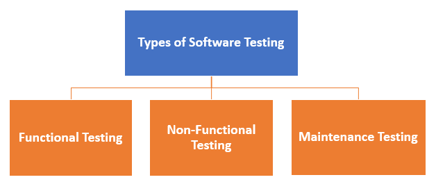

<h3>Types Of Software Testing</h3>

Here are the software Testing Type:

Typically Testing is clasified into three categories.

- **Functional Testing**
- **Non-Functional Testing or Performance Testing**
- **Maintenance (Regration and Maintence)**

Sub Type of <strong>Functional</strong> testing:

- **Unit Testing**
- **Integration Testing**
- **Smoke**
- **UAT (Acceptance Testing)**
- **Localization**
- **Globalization**
- **Interoperability**
- **So on**

Sub Type of <strong>Non-Functional</strong> testing:

- **Performance**
- **Enduance**
- **Load**
- **Volume**
- **Scalability**
- **Usability**
- **So on**

Sub Type of <strong>Maintenance</strong> testing:

- **Regression**
- **Maintenance**

This is not the complete list as there are more than <a href="Testing-Type.md"> 150 types of testing </a> types and still adding. Also, noteable is that not all testing types are applicable to all projects but depend on the nature & scope of the project. To explore a variety of testing tools and find the ones that suit your project requirements, <a href="Testing-tools.md">visit this list of testing tools.<a>